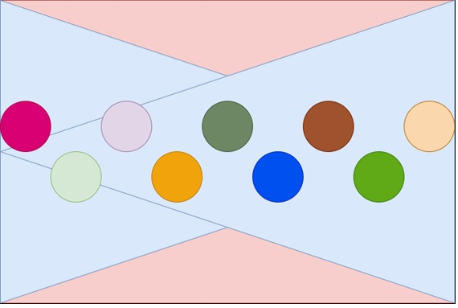
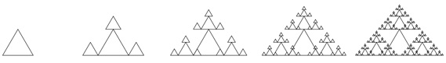

# ExercíciosJava
Escola Superior de Tecnologia e Gestão do
 * Instituto Politécnico de Beja

Exercícios de código java

TP01_01
-----------------------------------------------------
 * Escreva um programa que recebe um número inteiro positivo e escreva a metade
de um "triângulo" de números, exemplificada para o caso em que o número é 5.

TP01_02
-----------------------------------------------------
* Escreva um programa para escrever a quantidade de alunos de uma escola e para cada aluno uma nota. Ao final deve-se calcular e imprimir a média das
notas, deve-se imprimir a maior nota e o nome do aluno e imprimir a segunda maior nota e o nome do aluno.


TP02_01
-----------------------------------------------------
* Escreva um programa que receba o número de lados de um polígono
e um valor para esses lado, depois imprima a área do polígono.

TP02_02
-----------------------------------------------------
* Escreva um programa que pede o ano e as primeiras três letras do nome de um mês e escreve a 
  quantidade de dias desse mês. Note que a quantidade de dias do mês de fevereiro está dependente do 
  ano ser ou não bissexto. A quantidade de dias de cada ano resulta das seguintes regras.
  - O ano comum tem a duração de 365 dias.
  - Todos os anos múltiplos de 4 são bissextos, com 366 dias.
  - Os anos centenários não são bissextos excepto se forem múltiplos de 400. 
  Por isso o ano 2000 foi bissexto e 2400 também será. Assuma o calendário Gregoriano e datas posteriores à sua criação.

TP02_03
-----------------------------------------------------
* Ainda considerando o programa 2, se o utilizador indicar o mês "all", o programa irá escrever os dias de todos os meses 
  do ano indicado. Note que terá de utilizar um ciclo de 1 a 12 onde chama uma função com o nome 
  static String monthNumberToMonthName(int monthNumber)  que para cada número do mês (1 a 12) 
  devolve o nome. Depois, deve utilizar a função do programa 2.

TP02_04
-----------------------------------------------------
* Escreva um programa que utiliza uma função static String capitalizeName(String name) que recebe o 
  nome completo de uma pessoa e devolve esse nome com a letra inicial de cada nome capitalizada. 
  O resultado deve ser escrito na função main utilizando um System.out.println. Por exemplo:
  - Indique nome:  donald ervin knuth
  - Donald Ervin Knuth

TP03_01
-----------------------------------------------------
* Escreva um programa que pede um número n ímpar entre 3 e 15 e escreve asteriscos em 
  formato de diamante, tal como exemplficado em seguida para alguns valores de n. 
  Minimize a quantidade de instruções de escrita (print). Na verdade só precisa de um 
  print para escrever cada diamante. Para tal deve construir todo o diamante de asteriscos numa 
  String e só depois escrever essa String. Essa String deve ser criada pelo método 
  static String drawDiamond(int n). Note que a maior parte das linhas têm espaços e asteriscos.

TP03_02
-----------------------------------------------------
* Escreva um programa que pede ao utilizador o ano e o primeiro dia do ano (1 se for um domingo, 
  2 se for segunda-feira, etc).
  -  Seguidamente o programa escreve qual o dia da semana do primeiro dia de cada mês com o 
  seguinte formato (exemplificado para os primeiros três meses):
  -  Um de janeiro de 2020 será quarta-feira
  Um de fevereiro de 2020 será sábado
  Um de março de 2020 será domingo

TP03_03
-----------------------------------------------------
* Escreva um programa que permite testar a seguinte função:int[] positionsOfChar(String s, char c)
  
  - O array devolvido pela função deve conter as posições onde ocorre o char c. 
  Por exemplo, para a chamada 
  - int[] v = positionsOfChar("adfaDSaJKLa", 'a') o array v deve ficar com o seguinte conteúdo: {0, 3, 6, 10}

TP04_01
-----------------------------------------------------
* Dado um array de char e um array de int, defina uma função que troca as posições dos caracteres no primeiro array utilizando as posições indicadas no segundo. A função deve ter o seguinte cabeçalho (assinatura):
  
  static char[] swaps(char[] toSwap, int[] positionsToSwap);
  
  Note que o array positionsToSwap tem sempre uma quantidade par de elementos e cada dois valores seguidos nesse array indicam as posições a trocar no array toSwap.
  
  por exemplo, 
  
  swaps(new char[] {'A', 'B', 'C', 'D',  'E', 'F', 'G'}, new int[] {0, 1, 3, 6, 4, 5}) deve devolver um novo array com o seguinte conteúdo: {'B', 'A', 'C', 'G', 'F', 'E', 'D'}. Foram feita 3 trocas em sequência: a posição 0 com a posição 1, a posição 3 com a posição 6 e a posição 4 com a posição 5.
  
  swaps(new char[] {'A', 'B', 'C', 'D',  'E', 'F'}, new int[] {3, 1, 1, 2, 3, 4, 0, 1}) deve devolver um novo array com o seguinte conteúdo: {'C', 'A', 'D', 'E', 'B', 'F'}. Foram feita 4 trocas em sequência: a posição 3 com a posição 1, a posição 1 com a posição 2, a posição 3 com a posição 4 e a posição 0 com a posição 1.
  
  Note que o programa deve também definir uma função que devolve uma cópia de um array de char. Esta deve ter o cabeçalho  static char[] copy(char[] v).
  
  O programa deve testar os dois exemplos dados e funcionar para outros segundo a mesma lógica.
  
  Note que a função swaps deve começar por criar uma cópia do array toSwap e depois percorrer o array 
  positionsToSwap trocando as respetivas posições no array cópia. No final, basta devolver este array 
  onde foram feitas as trocas. Para trocar duas variáveis a e b pode utilizar uma terceira variável auxiliar:
  
  int temp = a;
  
  a = b;
  
  b = temp;


TP04_02
-----------------------------------------------------
* Escreva um programa que desenha um rectângulo (retângulo) com dois triângulos no fundo e N 
círculos dispostos em zig zag em relação ao centro vertical do rectângulo (retângulo).




- As cores do rectângulo e triângulos devem ser passadas como parâmetros da função que desenha a figura

- As cores dos círculos são aleatórias

- O número de círculos a desenhar é um parâmetro da função

- A dimensão de cada circulo depende da largura do rectângulo e de quantos círculos são.

As figuras em anexo têm strokes mas é só para facilitar a leitura. O ideal é que nem pareça que sejam dois triângulos.

A função deve ter o seguinte cabeçalho:

- void drawFigure(Pane pane, double x, double y, double width, double height, Color rectColor, Color triangleColor, int nCircles)

- Dever ter mais duas funções. uma para desenhar o fundo (rects e triângulos) e outra para desenhar os círculos.

- O programa deve utilizar a função drawFigure para desenhar 5 figuras em que cada figura é mais pequena do que a anterior.


TP05_01
-----------------------------------------------------
* Complete o seguinte programa, escrevendo o código da função inBoth que recebe dois vectores de inteiros e devolve um terceiro vector que contém apenas os números que estão em ambos os vectores e na mesma posição.
  ```sh
  public class TP05_01 { 
      public static void main(String[] args)
      {
           printlnV(inBoth(new int[] {1, 4, 3, 4}, new int[] {2, 4, 5, 6, 4, 3, 3}));
           printlnV(inBoth(new int[] {1, 1}, new int[] {2, 4, 3, 6, 4, 3, 3}));  
           printlnV(inBoth(new int[] {2, 4, 5, 4, 4, 3, 3}, new int[] {1, 4, 3, 4}));
           printlnV(inBoth(new int[] {1, 4, 3, 4}, new int[] {2, 4, 3, 6, 4, 3, 3}));
           printlnV(inBoth(new int[] {1, 2, 4, 5, 7, 9}, new int[] {2, 4, 3, 6, 7, 3, 8, 3}));
      }
      
      static int[] inBoth(int[] v1, int[] v2)
      {
         // TO DO
      }
      
      static void printlnV(int[] v)
      {
          for(int i = 0; i < v.length; i++)
          {
              System.out.print(v[i] + " ");
          }
          System.out.println();
      }
  
  } // end class TP05_01
  ```
  O programa exemplo deve escrever APENAS o seguinte
  ```
  4
  
  4 4
  4 3
  7
  ```
  O programa deve executar a função e escrever o resultado para o exemplo dado. Naturalmente, a função deve funcionar para quaisquer outros exemplos pelo que pode incluir mais exemplos da sua autoria. O programa pode conter mais métodos desde que todos na mesma classe TP05_01.


TP05_02
-----------------------------------------------------
* Escreva um programa com duas classes: a classe Drawing e a classe Trigss (class Trigss extends Group). A classe Drawing terá de utilizar o template disponível no BlueJ para um programa que utiliza JavaFX. 
   O programa deverá desenhar os 5 objectos na figura seguinte. Todos são objectos Trigss para valores de n entre 1 e 5 em que n é um parâmetro do objecto que indica o nível de recursividade. 
    
   O objecto mais à esquerda é um objecto Trigss com o valor de n igual a 1.
   - Os seguintes para a direita têm valores de n iguais a 2, 3, 4 e 5, respetivamente.
   - Os triângulos devem ser equiláteros (os lados de cada triângulo devem ter igual comprimento).
   